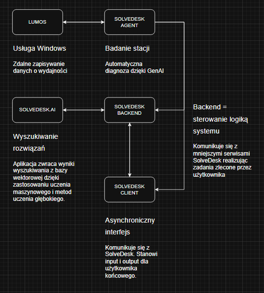

# Dominik Hofman – AI Engineer / Backend Developer

Projektuję i tworzę systemy oparte na sztucznej inteligencji, które automatyzują rzeczywiste procesy biznesowe z wykorzystaniem modeli LLM, agentów oraz usług backendowych.

---

## O mnie

Jestem magistrem inżynierem o praktycznym podejściu do rozwiązywania problemów, skupionym na wykorzystaniu AI w realnych zastosowaniach operacyjnych.

Swoją karierę rozpocząłem od projektowania graficznego i web designu, następnie rozwijałem się w obszarze wsparcia IT, gdzie zdobyłem zrozumienie procesów i potrzeb użytkowników w dużych organizacjach.

Dziś wykorzystuję to doświadczenie, budując systemy AI, które:
- redukują pracę manualną  
- zwiększają efektywność zespołów  
- porządkują i wykorzystują wiedzę operacyjną  

Specjalizuję się w łączeniu backendu z nowoczesnymi rozwiązaniami AI.

---

## Kluczowe kompetencje

- Projektowanie systemów AI end-to-end  
- Integracja modeli językowych (LLM) w aplikacjach backendowych  
- Budowa agentów AI i systemów decyzyjnych  
- Wyszukiwanie semantyczne (bazy wektorowe, cosine similarity)  
- Automatyzacja procesów i workflow  
- Tworzenie REST API (Python / FastAPI, C#)  
- Przetwarzanie danych i systemy wsparcia IT  

---

## Cel zawodowy

Rozwijam się w kierunku **AI Engineer**, budując systemy, które:
- automatyzują procesy biznesowe  
- wspierają podejmowanie decyzji  
- integrują AI z rzeczywistymi środowiskami produkcyjnymi  

---

## Podejście

Stawiam na:
- praktyczne zastosowania zamiast teorii  
- rozwiązywanie realnych problemów  
- skalowalne i utrzymywalne systemy  

---

## Diagram zależności projektów

### Main project: SolveDesk – system AI wspierający IT Support

System wykorzystujący sztuczną inteligencję do automatycznego wyszukiwania i generowania rozwiązań na podstawie historycznych zgłoszeń.

#### Funkcjonalności:
- Baza wektorowa do przechowywania wiedzy  
- Wyszukiwanie semantyczne (cosine similarity)  
- Generowanie odpowiedzi i wyjaśnień przy użyciu LLM  
- Automatyczna kategoryzacja zgłoszeń  
- Integracja poprzez REST API  

#### Stack technologiczny:
- Python (FastAPI)  
- LLM (lokalne / API)  
- Baza wektorowa  
- MSSQL / inne źródła danych  

#### Efekt biznesowy:
- Skrócenie czasu wyszukiwania rozwiązania  
- Ograniczenie pracy manualnej w IT Support  
- Standaryzacja wiedzy operacyjnej  

---

### Komponent: Lumos – usługa monitorowania systemu Windows

Usługa systemu Windows odpowiedzialna za monitorowanie stanu komputera oraz zbieranie i przetwarzanie danych diagnostycznych w celu analizy i wsparcia operacyjnego.

#### Funkcjonalności:
- Monitorowanie parametrów systemowych (CPU, RAM, dysk, procesy)  
- Zbieranie danych diagnostycznych z systemu Windows  
- Rejestrowanie zdarzeń i anomalii systemowych  
- Lokalna baza danych (SQLite) do przechowywania metryk  
- Integracja z systemami zewnętrznymi (np. AI / backend API)  

#### Stack technologiczny:
- C# (.NET / Windows Service)  
- SQLite  
- Systemowe API Windows  
- Integracja z backendem (REST API)  

#### Efekt biznesowy:
- Stały monitoring stanu urządzeń użytkowników  
- Szybsze wykrywanie problemów systemowych  
- Możliwość analizy danych historycznych  
- Fundament pod automatyzację diagnostyki (np. integracja z AI)

### Komponent: SolveDesk.Agent – agent diagnostyczny AI

API agenta odpowiedzialnego za analizę stanu stacji roboczej oraz automatyczną diagnostykę problemów z wykorzystaniem lokalnych modeli LLM.

#### Funkcjonalności:
- Przetwarzanie danych o wydajności systemu (CPU, RAM, dysk, procesy)  
- Analiza danych diagnostycznych w czasie rzeczywistym  
- Wykorzystanie lokalnego modelu LLM (Ollama / Qwen)  
- Automatyczne wykrywanie potencjalnych problemów i anomalii  
- Generowanie diagnoz oraz rekomendacji działań  
- Integracja z komponentami systemu (np. Lumos, backend API)  

#### Stack technologiczny:
- Python (FastAPI)  
- Ollama / Qwen (lokalne modele LLM)  
- Integracja z usługą Windows (Lumos)  
- REST API  

#### Efekt biznesowy:
- Automatyczna diagnostyka problemów bez udziału użytkownika  
- Skrócenie czasu analizy incydentów  
- Zmniejszenie obciążenia zespołów IT Support  
- Wprowadzenie inteligentnej warstwy decyzyjnej w systemie  

### Komponent: SolveDesk.AI – silnik AI do wyszukiwania i generowania rozwiązań

REST API odpowiedzialne za analizę zgłoszeń, wyszukiwanie podobnych przypadków oraz generowanie rozwiązań z wykorzystaniem modeli embeddingowych i LLM.

#### Funkcjonalności:
- Generowanie osadzeń (embeddings) przy użyciu modeli BERT  
- Wyszukiwanie semantyczne (cosine similarity) w bazie wektorowej  
- Dopasowywanie podobnych zgłoszeń i rozwiązań  
- Generowanie odpowiedzi i wyjaśnień z wykorzystaniem LLM  
- Automatyczna kategoryzacja problemów  
- Integracja z innymi komponentami systemu (Agent, backend, UI)  

#### Stack technologiczny:
- Python (FastAPI)  
- Modele embeddingowe (BERT)  
- LLM (lokalne / API)  
- Baza wektorowa  
- MSSQL / inne źródła danych  

#### Efekt biznesowy:
- Szybkie odnajdywanie trafnych rozwiązań na podstawie historii  
- Redukcja czasu obsługi zgłoszeń IT  
- Ujednolicenie i ponowne wykorzystanie wiedzy operacyjnej  
- Wsparcie decyzji poprzez AI-driven insights  

### Komponent: SolveDesk.Client – aplikacja frontendowa (UI)

Interfejs użytkownika umożliwiający interakcję z systemem SolveDesk, wizualizację danych oraz dostęp do funkcji diagnostycznych i AI.

#### Funkcjonalności:
- Interfejs do zgłaszania i przeglądania problemów  
- Prezentacja wyników analizy i rekomendacji AI  
- Wizualizacja danych diagnostycznych (np. wykresy, metryki)  
- Komunikacja z backendem poprzez REST API  
- Obsługa stanów aplikacji i interakcji użytkownika  

#### Stack technologiczny:
- React (TypeScript / TSX)  
- Biblioteki UI (np. komponenty, wykresy)  
- Integracja z REST API (SolveDesk.AI / Agent)  

#### Efekt biznesowy:
- Uproszczony dostęp do funkcji systemu dla użytkownika końcowego  
- Czytelna prezentacja danych i diagnoz AI  
- Skrócenie czasu reakcji na problemy  
- Lepsze doświadczenie użytkownika (UX)  

## Certyfikaty / Szkolenia

#### InQube Academy - Budowanie startupu (2026)

Projekt: food.flow
Cel: Aplikacja do inteligentnego planowania list zakupowych na podstawie osobistych preferencji

#### EY - Projektowanie i budowanie rozwiązań Data Science (2024)

#### ING - Data Science w praktyce (2024)

#### Datacamp - Data Manipulation with pandas (2024)

#### Datacamp - SQL Fundamentals (2024)

## Działalność naukowa / Wolontariat

#### jointhubs
- opracowanie pierwszej wersji interfejsu użytkownika

#### WAIT - Wroclaw AI Team
- projekt i wykonanie strony internetowej dla koła naukowego działającego w dziedzinie Data Science i AI

---

## Kontakt

Więcej informacji na moj temat znajdą Państwo na moim LinkedIn:

- LinkedIn: [https://www.linkedin.com/in/hofmandesign/]

---

Jesteśmy w kontakcie,
Dominik Hofman